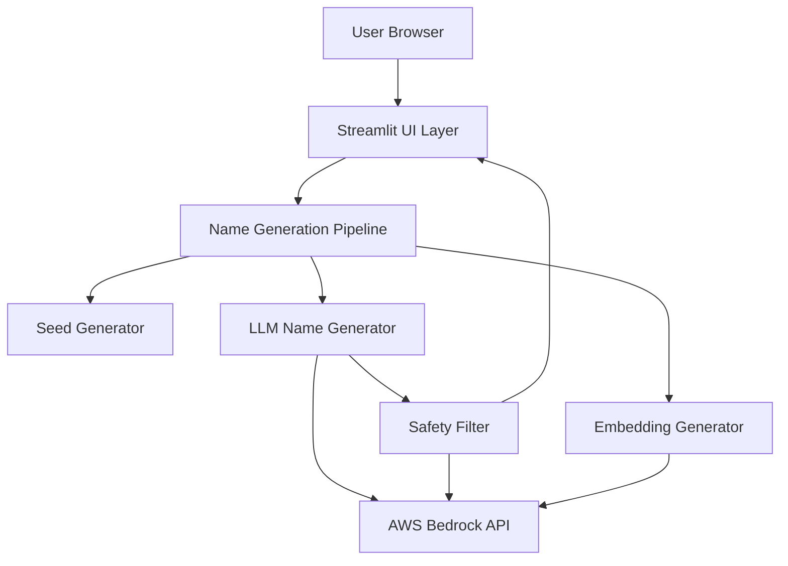

# Design Document

## Overview

The Festive Christmas Holiday Elf Name Generator is a Streamlit-based web application that generates personalized, family-friendly Christmas elf names using Amazon Bedrock's Nova 2 Lite model. The system employs a deterministic seeding mechanism combined with semantic embeddings to ensure reproducible yet varied name generation. A safety filter validates all generated names before display to ensure age-appropriate content.

The application architecture separates concerns into distinct layers: UI presentation (Streamlit), business logic (name generation pipeline), AI services (Bedrock integration), and safety validation. This design enables local execution while leveraging cloud-based AI capabilities.

## Architecture

### High-Level Architecture



### Component Layers

1. **Presentation Layer**: Streamlit-based UI with festive theming
2. **Business Logic Layer**: Name generation pipeline orchestrating seed creation, embedding generation, and LLM prompting
3. **AI Service Layer**: AWS Bedrock client managing Nova 2 Lite model interactions
4. **Validation Layer**: Safety filter ensuring family-friendly content

### Data Flow

1. User enters first name and selects birth month
2. System generates deterministic seed (SHA-256 hash)
3. System creates semantic embedding from input
4. Embedding values are converted to style instructions
5. LLM generates name using seed and style instructions
6. Safety filter validates the generated name
7. If unsafe, regenerate; if safe, display to user

## Components and Interfaces

### 1. Streamlit UI Component

**Responsibilities:**
- Render festive-themed input form
- Collect user's first name and birth month
- Display generated elf name with decorative styling
- Handle error states and loading indicators

**Interface:**
```python
class StreamlitUI:
    def render_input_form() -> tuple[str, str]:
        """Renders input form and returns (name, month)"""
        
    def display_elf_name(name: str) -> None:
        """Displays generated elf name with festive styling"""
        
    def display_error(message: str) -> None:
        """Displays error message to user"""
        
    def apply_festive_theme() -> None:
        """Applies CSS styling for Christmas theme"""
```

### 2. Prompt Generator Component

**Responsibilities:**
- Create deterministic prompts from user input
- Ensure reproducibility through consistent prompt structure
- Incorporate user context directly into generation prompts

**Interface:**
```python
class PromptGenerator:
    def generate_deterministic_prompt(first_name: str, birth_month: str, style_hints: dict) -> str:
        """
        Creates consistent prompt incorporating name, month, and style hints
        Returns: Formatted prompt string for LLM generation
        """
```

### 3. Embedding Generator Component

**Responsibilities:**
- Create semantic embeddings from user input
- Convert embedding values to style instructions

**Interface:**
```python
class EmbeddingGenerator:
    def __init__(self, bedrock_client: BedrockClient):
        """Initialize with Bedrock client for embedding API"""
        
    def generate_embedding(text: str) -> list[float]:
        """Creates embedding vector from input text"""
        
    def embedding_to_style_hints(embedding: list[float]) -> dict[str, str]:
        """
        Converts embedding values to semantic instructions
        Returns: Dictionary with keys like 'adjective_style', 'noun_style', 'twist'
        """
```

### 4. LLM Name Generator Component

**Responsibilities:**
- Construct prompts for name generation
- Call Nova 2 Lite model with seed and style hints
- Parse and return generated name

**Interface:**
```python
class LLMNameGenerator:
    def __init__(self, bedrock_client: BedrockClient):
        """Initialize with Bedrock client"""
        
    def generate_name(seed: str, style_hints: dict[str, str]) -> str:
        """
        Generates elf name using seed for reproducibility and style hints for variation
        Returns: Generated elf name (2-3 words)
        """
        
    def _build_prompt(seed: str, style_hints: dict[str, str]) -> str:
        """Constructs prompt with constraints and style guidance"""
```

### 5. Safety Filter Component

**Responsibilities:**
- Validate generated names for family-friendly content
- Detect inappropriate references (political, religious, body parts, suggestive)
- Regenerate names when unsafe content is detected

**Interface:**
```python
class SafetyFilter:
    def __init__(self, bedrock_client: BedrockClient):
        """Initialize with Bedrock client"""
        
    def validate_name(name: str) -> tuple[bool, str]:
        """
        Validates name safety
        Returns: (is_safe: bool, corrected_name: str)
        """
        
    def _check_safety(name: str) -> bool:
        """Uses LLM to evaluate name safety"""
        
    def _regenerate_safe_name(unsafe_name: str) -> str:
        """Generates corrected version of unsafe name"""
```

### 6. Bedrock Client Component

**Responsibilities:**
- Manage AWS Bedrock API connections
- Handle authentication and credentials
- Provide unified interface for model invocations

**Interface:**
```python
class BedrockClient:
    def __init__(self):
        """Initialize with AWS credentials from environment"""
        
    def invoke_nova_lite(prompt: str, seed: str = None) -> str:
        """
        Invokes Nova 2 Lite model
        Args:
            prompt: The prompt text
            seed: Optional seed for reproducibility
        Returns: Model response text
        """
        
    def generate_embedding(text: str) -> list[float]:
        """Generates embedding vector using Bedrock embedding model"""
```

### 7. Name Generation Pipeline Component

**Responsibilities:**
- Orchestrate the complete name generation workflow
- Coordinate between seed generation, embedding, LLM, and safety filter
- Handle retries for safety filter failures

**Interface:**
```python
class NameGenerationPipeline:
    def __init__(self, bedrock_client: BedrockClient):
        """Initialize with all required components"""
        
    def generate_elf_name(first_name: str, birth_month: str) -> str:
        """
        Main entry point for name generation
        Returns: Safe, validated elf name
        """
```

## Data Models

### User Input Model
```python
@dataclass
class UserInput:
    first_name: str
    birth_month: str  # One of: January, February, ..., December
    
    def validate(self) -> bool:
        """Validates input is non-empty and month is valid"""
```

### Generation Context Model
```python
@dataclass
class GenerationContext:
    seed: str  # 8-character hex string
    embedding: list[float]  # Vector representation
    style_hints: dict[str, str]  # Semantic instructions
```

### Elf Name Model
```python
@dataclass
class ElfName:
    name: str  # The generated elf name
    is_safe: bool  # Safety validation result
    generation_context: GenerationContext  # For debugging/logging
```

### Style Hints Model
```python
@dataclass
class StyleHints:
    adjective_style: str  # e.g., "cheerful", "cozy", "playful"
    noun_style: str  # e.g., "winter object", "natural element"
    twist: str  # e.g., "add sparkle", "add warmth"
    
    @staticmethod
    def from_embedding(embedding: list[float]) -> 'StyleHints':
        """Converts embedding values to style hints"""
```


## Correctness Properties

*A property is a characteristic or behavior that should hold true across all valid executions of a system—essentially, a formal statement about what the system should do. Properties serve as the bridge between human-readable specifications and machine-verifiable correctness guarantees.*

### Property 1: Single name output
*For any* valid first name and birth month combination, the system should return exactly one elf name (not zero, not multiple).
**Validates: Requirements 1.4**

### Property 2: Reproducibility
*For any* first name and birth month combination, generating an elf name multiple times should produce identical results every time.
**Validates: Requirements 1.5**

### Property 3: Family-friendly content
*For any* generated elf name, the name should contain no political references, no religious references, no body part references, and no suggestive content.
**Validates: Requirements 2.1, 2.2, 2.3, 2.4, 2.5**

### Property 4: Word count constraint
*For any* generated elf name, the name should consist of exactly 2 or 3 words when split by whitespace.
**Validates: Requirements 3.1**

### Property 5: Christmas-themed vocabulary
*For any* generated elf name, the name should contain at least one word related to Christmas themes (snow, light, candy, sparkle, animals, warmth, winter, or related festive concepts).
**Validates: Requirements 3.2**

### Property 6: Name pattern structure
*For any* generated elf name, the name should follow one of the specified patterns: Adjective-WinterObject, PlayfulVerb-CozyNoun, or SillyCharacterName-SeasonalFlair.
**Validates: Requirements 3.4**

### Property 7: Seed generation consistency
*For any* first name and birth month combination, the generated seed should be an 8-character hexadecimal string derived from SHA-256 hashing of the concatenated inputs.
**Validates: Requirements 4.1, 4.2**

### Property 8: Embedding generation
*For any* first name and birth month combination, the system should create a semantic embedding vector from the input.
**Validates: Requirements 4.4**

### Property 9: Embedding to style conversion
*For any* semantic embedding vector, the system should convert it into style instruction hints that guide name generation.
**Validates: Requirements 4.5**

## Error Handling

### Input Validation Errors

**Empty Name Input:**
- Validation: Check if first name is empty or whitespace-only
- Response: Display user-friendly message "Please enter your first name"
- Recovery: Keep form displayed, focus on name input field

**Invalid Month Selection:**
- Validation: Ensure selected month is one of the 12 valid months
- Response: Display message "Please select your birth month"
- Recovery: Keep form displayed, highlight month selector

### AWS Bedrock Errors

**Authentication Failure:**
- Detection: Catch AWS credential errors during Bedrock client initialization
- Response: Display message "Unable to connect to AI service. Please ensure AWS credentials are configured."
- Logging: Log full error details for administrator troubleshooting
- Recovery: Provide instructions for setting up AWS credentials

**API Rate Limiting:**
- Detection: Catch throttling exceptions from Bedrock API
- Response: Display message "Service is busy. Please try again in a moment."
- Recovery: Implement exponential backoff retry (3 attempts)

**Model Invocation Failure:**
- Detection: Catch errors during Nova Lite model calls
- Response: Display message "Unable to generate name. Please try again."
- Logging: Log error details including prompt and seed
- Recovery: Allow user to retry with same inputs

**Network Timeout:**
- Detection: Catch timeout exceptions during API calls
- Response: Display message "Request timed out. Please check your internet connection and try again."
- Recovery: Allow immediate retry

### Safety Filter Errors

**Unsafe Name Detection:**
- Detection: Safety filter returns is_safe=False
- Response: Automatically regenerate name (transparent to user)
- Retry Logic: Maximum 3 regeneration attempts
- Fallback: If all attempts fail, display generic safe name from fallback list

**Safety Filter Failure:**
- Detection: Safety filter itself throws exception
- Response: Log error and proceed with generated name (fail-open for availability)
- Logging: Alert administrators to safety filter malfunction

### Generation Errors

**Empty Name Generated:**
- Detection: LLM returns empty or whitespace-only response
- Response: Retry generation with modified prompt
- Retry Logic: Maximum 2 attempts
- Fallback: Use fallback name generation with template

**Malformed Name Generated:**
- Detection: Generated name doesn't match expected pattern (not 2-3 words)
- Response: Retry generation with stricter prompt constraints
- Retry Logic: Maximum 2 attempts
- Fallback: Parse and fix name format if possible

### System Errors

**Streamlit Session Error:**
- Detection: Catch Streamlit session state errors
- Response: Display message "Session error. Please refresh the page."
- Recovery: Provide refresh button

**Unexpected Exceptions:**
- Detection: Catch-all exception handler at pipeline level
- Response: Display message "An unexpected error occurred. Please try again."
- Logging: Log full stack trace for debugging
- Recovery: Reset application state, allow user to start over

## Testing Strategy

The testing strategy employs both unit testing and property-based testing to ensure comprehensive coverage of the elf name generator functionality.

### Unit Testing Approach

Unit tests will verify specific examples, edge cases, and integration points:

**Component-Level Tests:**
- Test SeedGenerator with known inputs produces expected 8-character hex seeds
- Test EmbeddingGenerator converts specific embedding values to correct style hints
- Test SafetyFilter correctly identifies known unsafe names
- Test BedrockClient handles authentication and API calls correctly
- Test UI components render expected elements

**Integration Tests:**
- Test complete pipeline with known inputs produces expected outputs
- Test error handling paths with mocked failures
- Test retry logic for safety filter and API failures

**Edge Case Tests:**
- Test with empty string inputs
- Test with very long name inputs
- Test with special characters in names
- Test with all 12 months
- Test safety filter with borderline content

### Property-Based Testing Approach

Property-based tests will verify universal properties across many randomly generated inputs. We will use the **Hypothesis** library for Python, which is the standard property-based testing framework for Python applications.

**Configuration:**
- Each property-based test will run a minimum of 100 iterations
- Tests will use Hypothesis's built-in strategies for generating random strings and selections

**Property Test Requirements:**
- Each property-based test MUST be tagged with a comment explicitly referencing the correctness property from this design document
- Tag format: `# Feature: elf-name-generator, Property {number}: {property_text}`
- Each correctness property MUST be implemented by a SINGLE property-based test

**Property Tests to Implement:**

1. **Reproducibility Property Test** (Property 2)
   - Generate random name and month combinations
   - Call generation function twice for each combination
   - Assert both calls return identical names
   - Tag: `# Feature: elf-name-generator, Property 2: Reproducibility`

2. **Family-Friendly Content Property Test** (Property 3)
   - Generate random name and month combinations
   - Generate elf names for each
   - Assert no names contain political, religious, body part, or suggestive terms
   - Use predefined blocklists for validation
   - Tag: `# Feature: elf-name-generator, Property 3: Family-friendly content`

3. **Word Count Property Test** (Property 4)
   - Generate random name and month combinations
   - Generate elf names for each
   - Assert each name has exactly 2 or 3 words
   - Tag: `# Feature: elf-name-generator, Property 4: Word count constraint`

4. **Christmas Theme Property Test** (Property 5)
   - Generate random name and month combinations
   - Generate elf names for each
   - Assert each name contains at least one Christmas-themed word
   - Use predefined list of Christmas vocabulary
   - Tag: `# Feature: elf-name-generator, Property 5: Christmas-themed vocabulary`

5. **Seed Generation Property Test** (Property 7)
   - Generate random name and month combinations
   - Generate seeds for each
   - Assert each seed is 8 characters long and hexadecimal
   - Assert seed is deterministic (same input = same seed)
   - Tag: `# Feature: elf-name-generator, Property 7: Seed generation consistency`

6. **Embedding Generation Property Test** (Property 8)
   - Generate random name and month combinations
   - Generate embeddings for each
   - Assert embeddings are non-empty lists of floats
   - Tag: `# Feature: elf-name-generator, Property 8: Embedding generation`

7. **Style Conversion Property Test** (Property 9)
   - Generate random embedding vectors
   - Convert to style hints
   - Assert style hints contain required keys (adjective_style, noun_style, twist)
   - Assert values are non-empty strings
   - Tag: `# Feature: elf-name-generator, Property 9: Embedding to style conversion`

### Test Organization

```
tests/
├── unit/
│   ├── test_seed_generator.py
│   ├── test_embedding_generator.py
│   ├── test_llm_name_generator.py
│   ├── test_safety_filter.py
│   ├── test_bedrock_client.py
│   └── test_pipeline.py
├── property/
│   ├── test_reproducibility.py
│   ├── test_safety_properties.py
│   ├── test_format_properties.py
│   └── test_generation_properties.py
└── integration/
    └── test_end_to_end.py
```

### Mocking Strategy

- Mock AWS Bedrock API calls in unit tests to avoid external dependencies
- Use real Bedrock calls in integration tests (requires AWS credentials)
- Mock safety filter in some tests to isolate generation logic
- Use dependency injection to make components testable

### Test Data

- Maintain list of known safe example names for validation
- Maintain blocklists for unsafe content detection
- Maintain list of Christmas-themed vocabulary for theme validation
- Use Hypothesis strategies for generating random but valid inputs
